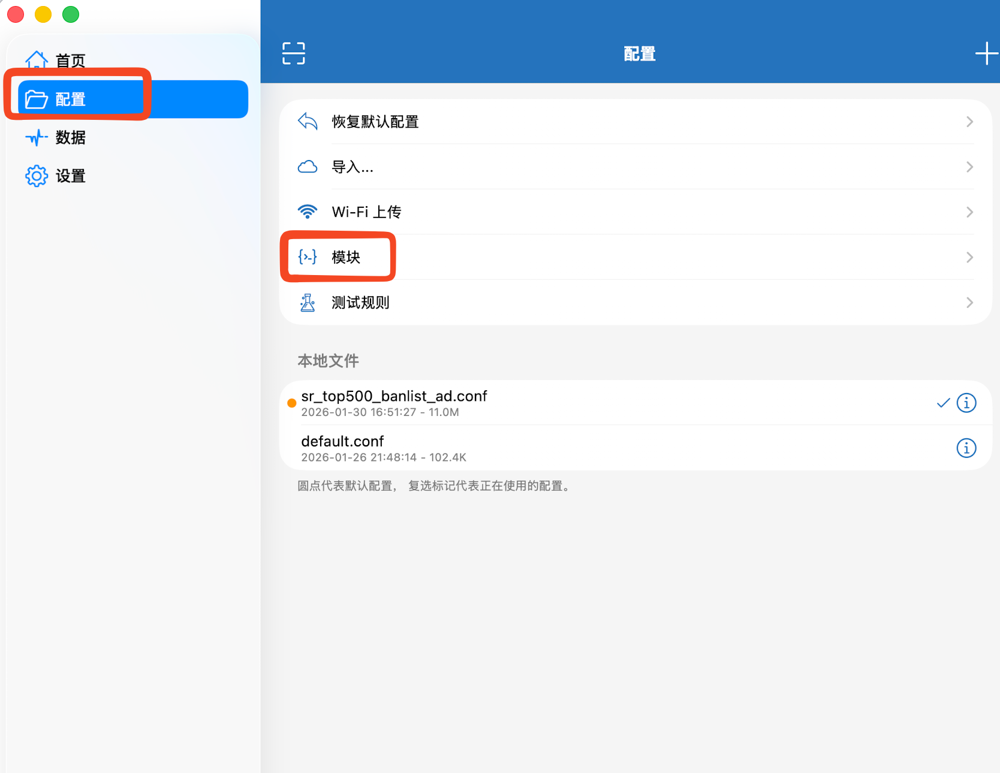
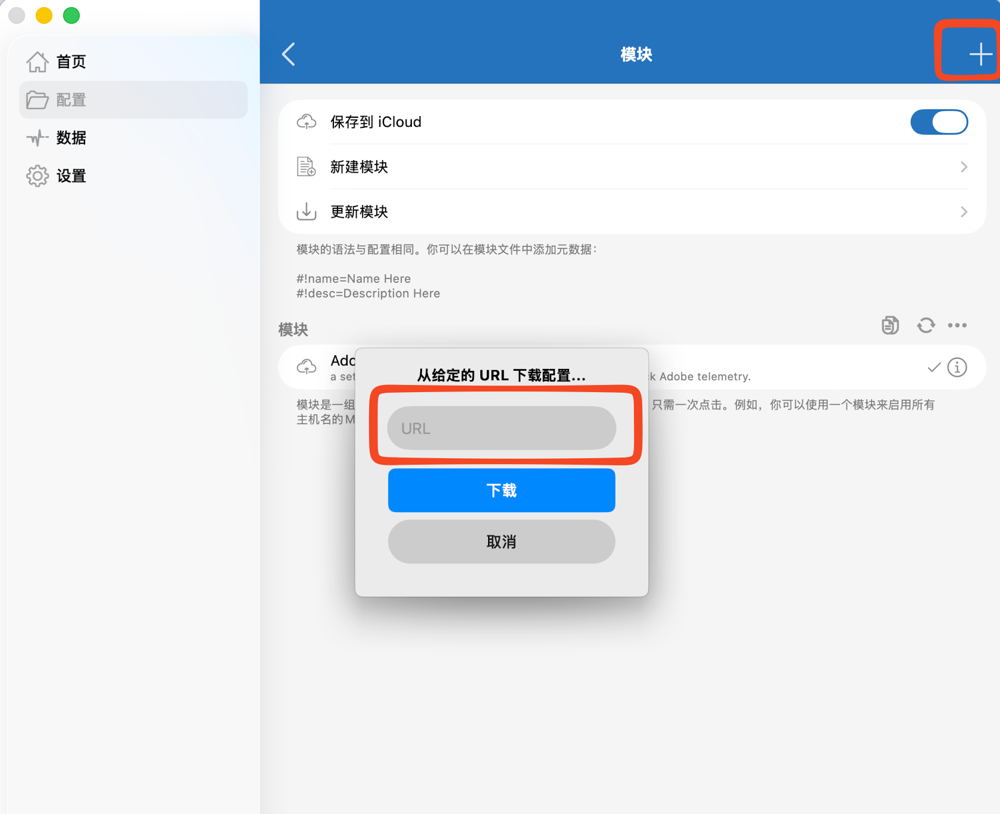

# Shadowrocket Rules for Blocking Adobe Telemetry 

This is a set of Shadowrocket rules designed to automatically block Adobe telemetry. 

These rules are based on the telemetry domains provided by [a-dove-is-dumb](https://github.com/ignaciocastro/a-dove-is-dumb?tab=BSD-2-Clause-1-ov-file) and are updated daily。

You can subscribe to these rules by adding the [this URL](https://raw.githubusercontent.com/dkphhh/a-dove-is-dumb-shadowrocket/refs/heads/main/adobe-reject.conf) to your Shadowrocket configuration。

这是一套 Shadowrocket rules，可以自动屏蔽来自 Adobe 的遥测。规则基于  a-dove-is-dumb 提供的遥测域名，每天自动更新。

你可以通过[这个链接](https://raw.githubusercontent.com/dkphhh/a-dove-is-dumb-shadowrocket/refs/heads/main/adobe-reject.conf)订阅

## 使用方法 / Usage：

你可以将其作为「模块」使用。它不会影响你的主配置，只会对其进行覆盖。

You can use it as a "modules." It won't affect your main configuration; it only overrides it.

1. 点击「配置」/ click "config"
2. 点击「模块」 / click "modules"

3. 点击右上角的「+」 / click "+" button
4. 将前述链接复制到输入框 / paste the url

